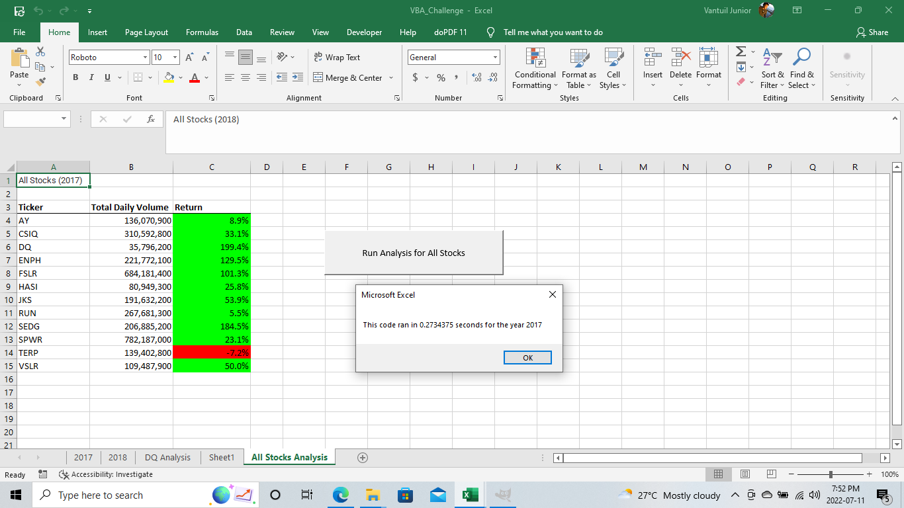
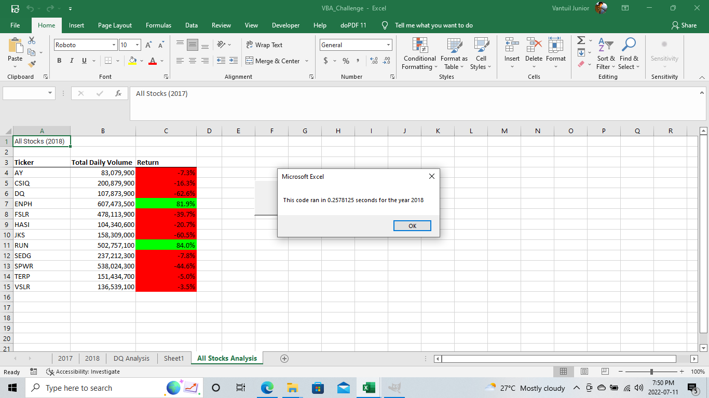

# Stock Analysis

## Overview of Project
After conducting a previous analysis, this project aims to expand the dataset to include the entire stock market throughout 2017 and 2018. The target is to make the code run appropriately for some stocks and work smoothly for several. The purpose of this analysis is to perform a comparison of the stock performance in the years mentioned forehand and focus on an objective way, providing a visualization clear and didactic.

## Sample Results
Based on the VBA script code handled, it was noticed that the stock market offered a solid ROI in 2017 compared to 2018, which makes us understand that the stock market was rising in 2017 and facing down in the following year. As it's explained in the picture below.

As can be seen, while 2017 was represented by solid growth in the stock market, we cannot say the same for the following year. When analyzing the image below, it is clear that the results were opposed, with the negative impact of most actions predominating.

## Summary:
In conclusion, programmers have a crystalline advantage when refactoring the code; the dataset is reinforced and provides an explained dashboard, highlighting the message.  On the other hand, the disadvantage is that it lacks more critical information, for instance, the opening price, closing price, high, low, and so on.
